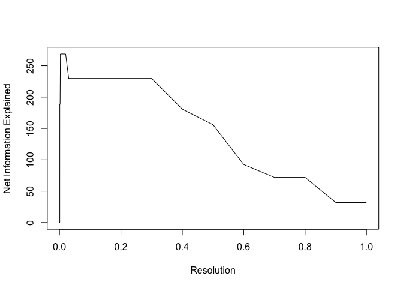
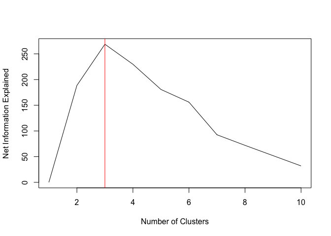

<!-- README.md is generated from README.Rmd. Please edit that file -->

# infohet

<!-- badges: start -->

[](https://codecov.io/gh/mjcasy/infohet?branch=master)
<!-- badges: end -->

Package for the quantification of the information content of single-cell
RNA-sequencing data-sets, and how much of this information has been
explained by clustering. Based on the quantification of information in
heterogeneity (infohet). Preprint -
<https://www.biorxiv.org/content/10.1101/2020.10.01.322255v1>

The package can be used for the calculation of several information
theoretic quantities, most importantly:

1.  Het - gene-wise measure of information obtained
2.  Net Information - measure of the information explained by a given
    clustering, penalised by the complexity of the clustering

Het and net information can be used for feature selection and clustering
evaluation, as presented below:

## Installation

``` r
install.packages("devtools")
devtools::install_github("mjcasy/infohet")
```

## Workflow

We will use a dataset with a known cluster structure for this example.
ScMixology (<https://github.com/LuyiTian/sc_mixology>) has several
datasets that consist of mixtures of cancer cell lines, enabling the
identity of each cell to be identified by genotyping. We will be using
the mixture of three cell lines (sincell\_with\_class.RDat).

Setup. Load in Data and filter low expressing genes (less than 100
transcripts total). Note that infohet works off of the sparse matrix
format (“dgCMatrix”). This is the same object type as used in the
popular Seurat package, and a normal numeric matrix can be converted to
the sparse format using the Seurat function as.sparse().

``` r
library(infohet)
library(RColorBrewer)
library(Matrix)

load("../Data/Tian2018/ThreeClasses/CountsMatrix")
CountsMatrix <- CountsMatrix[rowSums(CountsMatrix) > 100,]
```

### Feature Selection

We can determine the amount of information in the heterogeneity of each
genes expression pattern. This is the number of bits required to encode
the deviation of observed gene expression from homogeneity, i.e. equal
gene expression in each cell.

We then select highly informative genes by thresholding, choosing those
genes with more than 1 bit of information.

``` r
Information <- getHet(CountsMatrix)

HighlyInformative <- Information > 1

N <- CountsMatrix@Dim[2]
Mean <- log10(rowMeans(CountsMatrix))

HetDataFrame <- data.frame(Mean, Information)

ColourSelected <- brewer.pal(9, "Blues")[8]
ColourNotSelected <- brewer.pal(9, "Blues")[4]

plot(HetDataFrame$Mean, 
     HetDataFrame$Information,
     col = ifelse(HighlyInformative, ColourSelected, ColourNotSelected),
     ylim = c(0, log2(N)),
     pch = 20)
```


### Clustering Evaluation

Information is additively decomposable based on a given clustering of
cells into that information explained by the differential expression of
a gene between clusters, and that which remains unexplained.

Given the goal of clustering is to explain the heterogeneity in gene
expression, information explained is a natural measure for cluster
evaluation.

Further, information is additive between independent sources. Taking
each gene as independent, the total information explained by a given
clustering can be found.

Finally, note that information will never increase with increasing
cluster number. We account for this increase by quantifying the amount
of information required to encode a given cluster structure, \(H(S)\)
and penalizing clusterings accordingly. We can therefore calcuate the
net information explained by a given clustering.

Being a global measure of cluster quality, independent of cluster
number, net information can serve as a powerful basis of hyperparameter
selection. For instance, determining that there are three discrete
cellular identities in the scMixology data set.

``` r
library(Seurat)

load("../Data/Tian2018/ThreeClasses/Identity")

SeuObj <- Seurat::CreateSeuratObject(CountsMatrix)
SeuObj <- Seurat::SCTransform(SeuObj)
Data <- SeuObj@assays$SCT@scale.data

SeuObj <- RunPCA(SeuObj, verbose = FALSE)
SeuObj <- FindNeighbors(SeuObj, dims = 1:30, verbose = FALSE)
```

``` r
Resolutions <- c(seq(0.0001, 0.001, 0.0001), seq(0.002, 0.01, 0.001), seq(0.02, 0.2, 0.01), seq(0.3, 1, 0.1))

NumClusters <- c()
NetInformation <- c()

for(i in 1:length(Resolutions)){
  Idents(SeuObj) <- NA
  
  SeuObj <- FindClusters(SeuObj, verbose = FALSE, resolution = Resolutions[i])
  
  Identity <- Idents(SeuObj)
  
  NetInformation[i] <- netInformation(CountsMatrix, Identity, Information)
  
  NumClusters[i] <- length(levels(Identity))
}

Elbow <- cbind(Resolutions, NumClusters, NetInformation)
```




