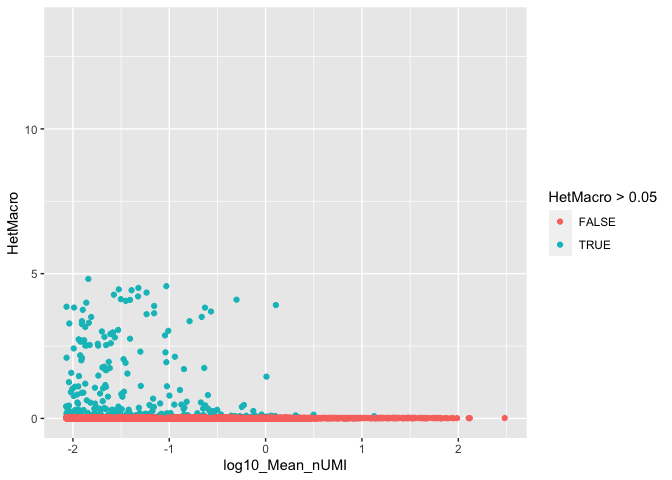

<!-- README.md is generated from README.Rmd. Please edit that file -->

# infohet

<!-- badges: start -->

<!-- badges: end -->

Pacakge for the calculation of the information in gene expression
heterogeneity. Workflow below is for scRNA-seq, but it is potentially
applicable to a wider range of data.

Primary function is the calculation of Het, the minimum information that
would be required to encode the observed heterogeneity in gene
expression.

Het can serve as the basis for various tasks in scRNA-seq analysis, with
application to feature selection, cluster quality assesment and
identification of differentially expressed genes.

## Installation

``` r
install.packages("devtools")
devtools::install_github("mjcasy/infohet")
```

## Workflow

General setup. Load in Data and filter low expressing genes (less than
100 transcripts total).

``` r
library(infohet)
library(ggplot2)

# Sparse Counts Matrix
load("../Data/10x/CountsMatrix")

# Cluster labels
load("../Data/10x/Identity")

MinTotal <- 100
InfoThreshold <- 0.5

Total <- Matrix::rowSums(CountsMatrix)
if(any(Total < MinTotal)){
   CountsMatrix <- CountsMatrix[-which(Total < MinTotal),]
   Total <- Total[-which(Total < MinTotal)]
}
```

Feature Selection. The Het of each gene is found and adjusted for
sparisty. Genes with excessive Het compared to simulation of the null
are identified for selection.

``` r
Het <- get_Het(CountsMatrix)
HetAdj <- subtract_HetSparse(Het, CountsMatrix)

NullHet <- simulate_Hom(CountsMatrix)
NullHet <- subtract_HetSparse(NullHet, CountsMatrix)

Threshold <- NullHet+InfoThreshold

N <- CountsMatrix@Dim[2]
Mean_nUMI <- Total / N

HetDataFrame <- data.frame(log10(Mean_nUMI), HetAdj, NullHet, Threshold, HetAdj > Threshold)
colnames(HetDataFrame) <- c("log10_Mean_nUMI", "Het", "Null_Model", "Threshold", "Selected")

ggplot(HetDataFrame, aes(x = log10_Mean_nUMI, y = Het, colour = Selected)) + geom_point() +
  geom_line(aes(y = Null_Model), colour = "black") + 
  ylim(0, log2(N))
#> Warning: Removed 14 rows containing missing values (geom_point).
#> Warning: Removed 744 rows containing missing values (geom_path).
```


Cluster Quality. HetMicro is the gene-wise measure of information left
unexplained by some labelling of cells. This labelling is typically the
results of clustering for cell type identification. Genes with excessive
HetMicro are inadequately explained by the clustering.

``` r
GroupedCounts <- group_Counts(CountsMatrix, Identity)

HetMicro <- get_HetMicro(CountsMatrix, Identity, GroupedCounts)
HetMicroAdj <- subtract_HetSparse(HetMicro, CountsMatrix)

HetDataFrame <- cbind(HetDataFrame, HetMicroAdj)

ggplot(HetDataFrame, aes(x = log10_Mean_nUMI, y = HetMicroAdj, colour = Selected)) + geom_point() +
  geom_line(aes(y = Null_Model), colour = "black") + 
  ylim(-log2(MinTotal), log2(N))
```


Differential Gene Expression. HetMacro is the information explained by a
grouping of cells. When only two labels are supplied, HetMacro is
analogous to DGE tests. Most genes will have a non-zero amount of
HetMacro due to technical effects. Either an arbitrary threshold
(e.g. 0.05 bits) should be used or the labelling can be permuted and
the mean HetMacro from a set of pwermutations used.

``` r
DEGroup <- factor(ifelse(Identity == 17, "1", "2"))

GroupedCounts <- group_Counts(CountsMatrix, DEGroup)

HetMacro <- get_HetMacro(CountsMatrix, DEGroup, GroupedCounts)

HetDataFrame <- cbind(HetDataFrame, HetMacro)

ggplot(HetDataFrame, aes(x = log10_Mean_nUMI, y = HetMacro, colour = HetMacro > 0.05)) + geom_point() +
  ylim(0, log2(N))
```


