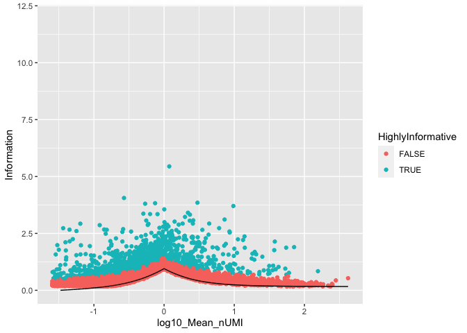
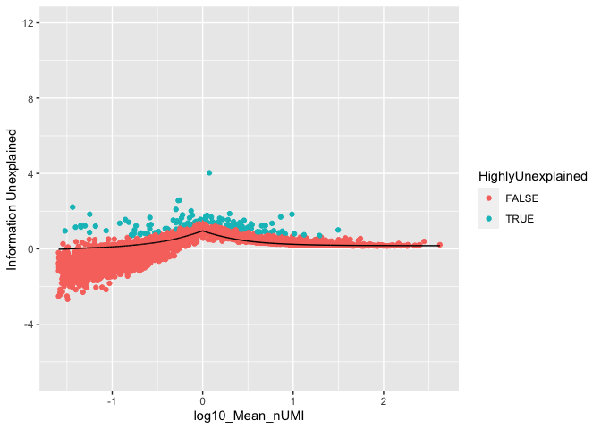

<!-- README.md is generated from README.Rmd. Please edit that file -->

# infohet

<!-- badges: start -->

<!-- badges: end -->

Package for the quantification of the information content of single-cell
RNA-sequencing data-sets, and how much of this information has been
captured by clustering. Based on the quantification of information in
heterogeneity (infohet).

## Installation

``` r
install.packages("devtools")
devtools::install_github("mjcasy/infohet")
```

## Workflow

General setup. Load in Data and filter low expressing genes (less than
100 transcripts total).

``` r
library(infohet)
library(ggplot2)
library(Seurat)

load("../Data/Tian2018/CountsMatrix")

infoThreshold <- 0.5
minTotal <- 100

Total <- Matrix::rowSums(CountsMatrix)
if(any(Total < minTotal)){
   CountsMatrix <- CountsMatrix[-which(Total < minTotal),]
   Total <- Total[-which(Total < minTotal)]
}
```

Visualise gene-wise information - the amount of information gain from
knowing the cellular allocation of transcripts for each gene.

Homogeneity, adjusted for the difference in total count depths of cells,
is simulated to provide a null baseline of information.

``` r
Het <- getHet(CountsMatrix)
HetAdj <- subtractHetSparse(Het, CountsMatrix)

nullHet <- simulateHom(CountsMatrix)
nullHet <- subtractHetSparse(nullHet, CountsMatrix)

HighlyInformative <- HetAdj > nullHet + infoThreshold

N <- CountsMatrix@Dim[2]
Mean_nUMI <- Total / N

HetDataFrame <- data.frame(log10(Mean_nUMI), HetAdj, nullHet)
colnames(HetDataFrame) <- c("log10_Mean_nUMI", "Information", "Null_Model")

ggplot(HetDataFrame, aes(x = log10_Mean_nUMI, y = Information, colour = HighlyInformative)) + geom_point() +
  geom_line(aes(y = Null_Model), colour = "black") + 
  ylim(0, log2(N))
#> Warning: Removed 130 row(s) containing missing values (geom_path).
```



Generate set of clusters, e.g. from Seurat pipeline, ranging over
hyperparameter of interest, e.g. resolution.

``` r
SeuObj <- Seurat::CreateSeuratObject(CountsMatrix)
SeuObj <- Seurat::SCTransform(SeuObj)

SeuObj <- RunPCA(SeuObj, verbose = FALSE)

SeuObj <- FindNeighbors(SeuObj, dims = 1:30, verbose = FALSE)

NumClusters <- c()
InformationExplained <- c()
Resolutions <- c(seq(0.0001, 0.001, 0.0001), seq(0.002, 0.01, 0.001), seq(0.02, 0.2, 0.01), seq(0.3, 1, 0.1))

for(i in 1:length(Resolutions)){
  Idents(SeuObj) <- NA
  SeuObj <- FindClusters(SeuObj, verbose = FALSE, resolution = Resolutions[i])
  
  Identity <- Idents(SeuObj)
  
  GroupedCounts <- groupCounts(CountsMatrix, Identity)
  
  HetMacro <- getHetMacro(CountsMatrix, Identity, GroupedCounts)
  
  NumClusters[i] <- length(levels(Identity))
  InformationExplained[i] <- sum(HetMacro) 
}

Elbow <- cbind(Resolutions, NumClusters, InformationExplained)
```

Elbow Plot of total information explained by clustering against
resolution hyperparameter and cluster
number


Gene-wise information left unexplained by chosen clustering

``` r
GroupedCounts <- groupCounts(CountsMatrix, SeuObj$SCT_snn_res.0.01)
HetMicro <- getHetMicro(CountsMatrix, SeuObj$SCT_snn_res.0.01, GroupedCounts)
HetMicro <- subtractHetSparse(HetMicro, CountsMatrix)

HighlyUnexplained <- HetMicro > nullHet + infoThreshold

HetDataFrame <- cbind(HetDataFrame, HetMicro)
ggplot(HetDataFrame, aes(x = log10_Mean_nUMI, y = HetMicro, colour = HighlyUnexplained)) + geom_point() +
  geom_line(aes(y = Null_Model), colour = "black") + 
  ylim(-log2(minTotal), log2(N)) +
  ylab("Information Unexplained")
```


