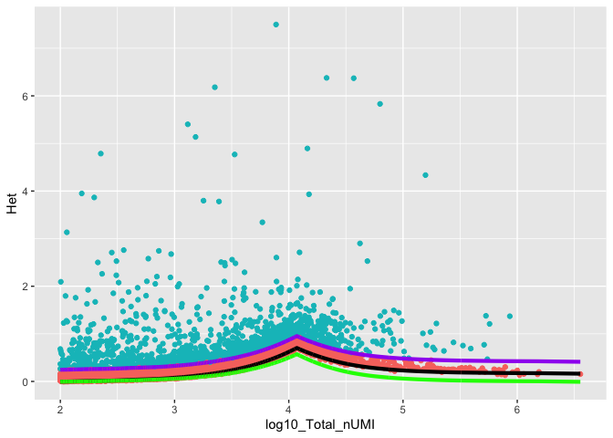

<!-- README.md is generated from README.Rmd. Please edit that file -->

# infohet

<!-- badges: start -->

<!-- badges: end -->

The goal of infohet is to calculate the information in heterogenity of
scRNA-seq data.

## Installation

And the development version from [GitHub](https://github.com/) with:

``` r
# install.packages("devtools")
devtools::install_github("mcaseySoton/infohet")
```

## Example

This is a basic example which shows you how to solve a common problem:

``` r
library(infohet)
library(ggplot2)
load("~/OneDrive - University of Southampton/Data/10x/CountsMatrix")
load("~/OneDrive - University of Southampton/Data/10x/Identity")

MinTotal <- 100
TestTotalStep <- 0.2
NumTrials <- 50
InfoThreshold <- 0.25

Total <- Matrix::rowSums(CountsMatrix)
if(any(Total < MinTotal)){
   CountsMatrix <- CountsMatrix[-which(Total < MinTotal),]
   Total <- Total[-which(Total < MinTotal)]
}

Range <- range(log10(Total))
TotalCounts <- round(10^seq(1, Range[2], TestTotalStep))


Het <- get_Het(CountsMatrix)
HetAdj <- subtract_HetSparse(Het, CountsMatrix)

NullHet <- simulate_Hom(CountsMatrix, TotalCounts, NumTrials)
NullHet <- subtract_HetSparse(NullHet, CountsMatrix)

NullHetUnif <- simulate_Hom(CountsMatrix, TotalCounts, NumTrials, depth_adjusted = F)
NullHetUnif <- subtract_HetSparse(NullHetUnif, CountsMatrix)

Threshold <- NullHet+InfoThreshold

HetDataFrame <- data.frame(log10(Total), Het, HetAdj, NullHet, Threshold, HetAdj > Threshold, NullHetUnif)
colnames(HetDataFrame) <- c("log10_Total_nUMI", "Het", "Total_Heterogeneity", "Null_Model", "Threshold", "Selected", "Uniform_Null")

OG <- ggplot(HetDataFrame, aes(x = log10_Total_nUMI, y = Total_Heterogeneity, colour = Selected)) + geom_point() +
  geom_line(aes(y = Null_Model), colour = "black", size = 1.5) +
  geom_line(aes(y = Threshold), colour = "purple", size = 1.5) +
  geom_line(aes(y = Uniform_Null), colour = "green", size = 1.5) +
  theme(legend.position = "none") +
  ylab("Het")
OG
```


