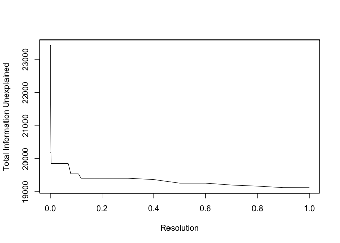
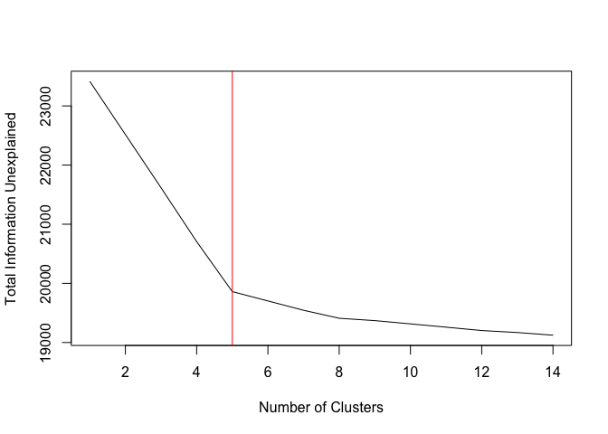

<!-- README.md is generated from README.Rmd. Please edit that file -->

# infohet

<!-- badges: start -->

[](https://codecov.io/gh/mjcasy/infohet?branch=master)
<!-- badges: end -->

Package for the quantification of the information content of single-cell
RNA-sequencing data-sets, and how much of this information has been
explained by clustering. Based on the quantification of information in
heterogeneity (infohet). Preprint -
<https://www.biorxiv.org/content/10.1101/2020.10.01.322255v1>

## Installation

``` r
install.packages("devtools")
devtools::install_github("mjcasy/infohet")
```

## Workflow

We will use a dataset with a known cluster structure for this example.
ScMixology (<https://github.com/LuyiTian/sc_mixology>) has several
datasets that consist of mixtures of cancer cell lines, enabling the
identity of each cell to be identified by genotyping. We will be using
the mixture of five cell lines (sincell\_with\_class\_5cl.RDat).

Setup. Load in Data and filter low expressing genes (less than 100
transcripts total).

``` r
library(infohet)
library(RColorBrewer)

# CountsMatrix
load("../Data/Tian2018/CountsMatrix")

infoThreshold <- 0.5
minTotal <- 100

Total <- Matrix::rowSums(CountsMatrix)
if(any(Total < minTotal)){
   CountsMatrix <- CountsMatrix[-which(Total < minTotal),]
   Total <- Total[-which(Total < minTotal)]
}
```

### Feature Selection

We can determine the amount of information in the heterogeneity of each
genes expression pattern. This is the number of bits required to encode
the deviation of observed gene expression from homogeneity, i.e. equal
gene expression in each cell.

Some amount of information is expected from technical sources, so we
simulate the effects of sparsity, cellular count depth variation and
stochastic fluctuations.

We then select those genes with at least some set amount (here 0.5 bits)
more information than expected from technical effects. These are the
highly informative genes.

``` r
Het <- getHet(CountsMatrix)

nullHet <- simulateHom(CountsMatrix)

HighlyInformative <- Het > nullHet + infoThreshold

N <- CountsMatrix@Dim[2]
Mean_nUMI <- Total / N

HetDataFrame <- data.frame(log10(Mean_nUMI), Het, nullHet)
colnames(HetDataFrame) <- c("log10_Mean_nUMI", "Unexplained_Information", "Null_Model")

ColourSelected <- brewer.pal(9, "Blues")[8]
ColourNotSelected <- brewer.pal(9, "Blues")[4]
Order <- order(HetDataFrame$log10_Mean_nUMI)

with(HetDataFrame, plot(log10_Mean_nUMI, 
                        Unexplained_Information,
                        col = ifelse(HighlyInformative, ColourSelected, ColourNotSelected),
                        ylim = c(0, log2(N)),
                        pch = 20)
     )
lines(HetDataFrame$log10_Mean_nUMI[Order], HetDataFrame$Null_Model[Order], col = "red", lwd = 2)
```


### Cluster Quality Evaluation

Information is additively decomposable based on a given clustering of
cells into that information explained by the differential expression of
a gene between clusters, and that which remains unexplained.

Given the goal of clustering is to explain the heterogeneity in gene
expression, and we can calculate the amount of information in
heterogeneity that is explained by clustering, information is a natural
measure for cluster evaluation.

Using the known ground truth cluster structure of the scMixology data,
we can carry out a gene-wise assessment of the information that remains
unexplained.

More generally, if the ground truth clustering is not known, genes that
retain a large amount of unexplained information are potentially
interesting features for use in re/sub-clustering.

``` r
# Identitiy
load("../Data/Tian2018/Identity")

Clustered_Unexplained_Information <- getHetMicro(CountsMatrix, Identity)
HetDataFrame <- cbind(HetDataFrame, Clustered_Unexplained_Information)

HighlyInformativeDecomp <- Clustered_Unexplained_Information > nullHet + infoThreshold

with(HetDataFrame, plot(log10_Mean_nUMI, 
                        Clustered_Unexplained_Information,
                        col = ifelse(HighlyInformativeDecomp, ColourSelected, ColourNotSelected),
                        ylim = c(0, log2(N)),
                        pch = 20)
     )
lines(HetDataFrame$log10_Mean_nUMI[Order], HetDataFrame$Null_Model[Order], col = "red", lwd = 2)
```


Information is additive between independent sources. Taking each gene as
independent, the total information left unexplained in the transcriptome
can be found.

Given the goal of clustering is to identify a set of homogenous
subpopulations, i.e. cell types, the chosen clustering should minimise
the total amount of information left unexplained.

We can demonstrate the relationship between closeness to the ground
truth (Rand Index) and information using K-means.

``` r
library(Seurat)
require(fossil)

SeuObj <- Seurat::CreateSeuratObject(CountsMatrix)
SeuObj <- Seurat::SCTransform(SeuObj)
Data <- SeuObj@assays$SCT@scale.data

Trials <- 1000

RandInd <- vector("numeric", Trials)
InformationUnexplained <- vector("numeric", Trials)

for(i in 1:Trials){
  KM <- kmeans(t(Data), 5)
  RandInd[i] <- fossil::rand.index(KM$cluster, as.numeric(Identity))
  
  HetMicro <- getHetMicro(CountsMatrix, as.factor(KM$cluster))
  InformationUnexplained[i] <- sum(HetMicro) 
}
```


Note that, all else being equal, information will never decrease with
increasing cluster number. There is therefore a trade-off - the optimal
clustering is that which leaves the least information unexplained in the
fewest clusters. This can be assessed by an elbow analysis, shown below
using the Seurat (v3) clustering pipeline.

``` r
SeuObj <- RunPCA(SeuObj, verbose = FALSE)

SeuObj <- FindNeighbors(SeuObj, dims = 1:30, verbose = FALSE)

NumClusters <- c()
InformationUnexplained <- c()
Resolutions <- c(seq(0.0001, 0.001, 0.0001), seq(0.002, 0.01, 0.001), seq(0.02, 0.2, 0.01), seq(0.3, 1, 0.1))

for(i in 1:length(Resolutions)){
  Idents(SeuObj) <- NA
  SeuObj <- FindClusters(SeuObj, verbose = FALSE, resolution = Resolutions[i])
  
  Identity <- Idents(SeuObj)
  
  HetMicro <- getHetMicro(CountsMatrix, Identity)
  
  NumClusters[i] <- length(levels(Identity))
  InformationUnexplained[i] <- sum(HetMicro) 
}

Elbow <- cbind(Resolutions, NumClusters, InformationUnexplained)
```

Elbow Plot of total information explained by clustering against
resolution hyperparameter and cluster number




