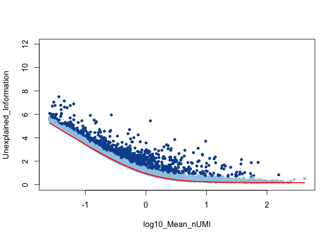
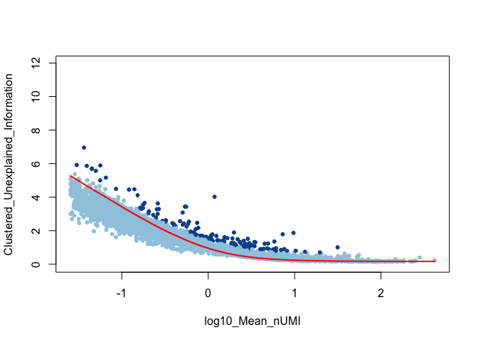
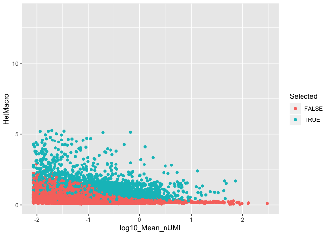

<!-- README.md is generated from README.Rmd. Please edit that file -->

# infohet

<!-- badges: start -->

<!-- badges: end -->

The goal of infohet is to calculate the information in heterogenity of
scRNA-seq data.

## Installation

And the development version from [GitHub](https://github.com/) with:

``` r
# install.packages("devtools")
devtools::install_github("mjcasy/infohet")
```

## Workflow

General setup. Load in Data and filter low expressing genes.

``` r
library(infohet)
library(ggplot2)

load("../Data/10x/CountsMatrix")
load("../Data/10x/Identity")

MinTotal <- 100
InfoThreshold <- 0.25

Total <- Matrix::rowSums(CountsMatrix)
if(any(Total < MinTotal)){
   CountsMatrix <- CountsMatrix[-which(Total < MinTotal),]
   Total <- Total[-which(Total < MinTotal)]
}
```

Standard sworkflow for the identification of informative genes.

``` r
Het <- get_Het(CountsMatrix)
HetAdj <- subtract_HetSparse(Het, CountsMatrix)

NullHet <- simulate_Hom(CountsMatrix)
NullHet <- subtract_HetSparse(NullHet, CountsMatrix)

Threshold <- NullHet+InfoThreshold

N <- CountsMatrix@Dim[2]
Mean_nUMI <- Total / N

HetDataFrame <- data.frame(log10(Mean_nUMI), HetAdj, NullHet, Threshold, HetAdj > Threshold)
colnames(HetDataFrame) <- c("log10_Mean_nUMI", "Het", "Null_Model", "Threshold", "Selected")

ggplot(HetDataFrame, aes(x = log10_Mean_nUMI, y = Het, colour = Selected)) + geom_point() +
  geom_line(aes(y = Null_Model), colour = "black") + 
  ylim(0, log2(N))
#> Warning: Removed 14 rows containing missing values (geom_point).
#> Warning: Removed 14 rows containing missing values (geom_path).
```



``` r
GroupedCounts <- group_Counts(CountsMatrix, Identity)

HetMacro <- get_HetMacro(CountsMatrix, Identity, GroupedCounts)

HetMicro <- get_HetMicro(CountsMatrix, Identity, GroupedCounts)
HetMicroAdj <- subtract_HetSparse(HetMicro, CountsMatrix)

HetDataFrame <- cbind(HetDataFrame, HetMacro, HetMicroAdj)

Ylims <- c(min(HetMicroAdj), log(ncol(CountsMatrix)))

ggplot(HetDataFrame, aes(x = log10_Mean_nUMI, y = HetMicroAdj, colour = Selected)) + geom_point() +
  geom_line(aes(y = Null_Model), colour = "black") + 
  ylim(-log2(MinTotal), log2(N))
```



``` r

ggplot(HetDataFrame, aes(x = log10_Mean_nUMI, y = HetMacro, colour = Selected)) + geom_point() +
  ylim(0, log2(N))
```


